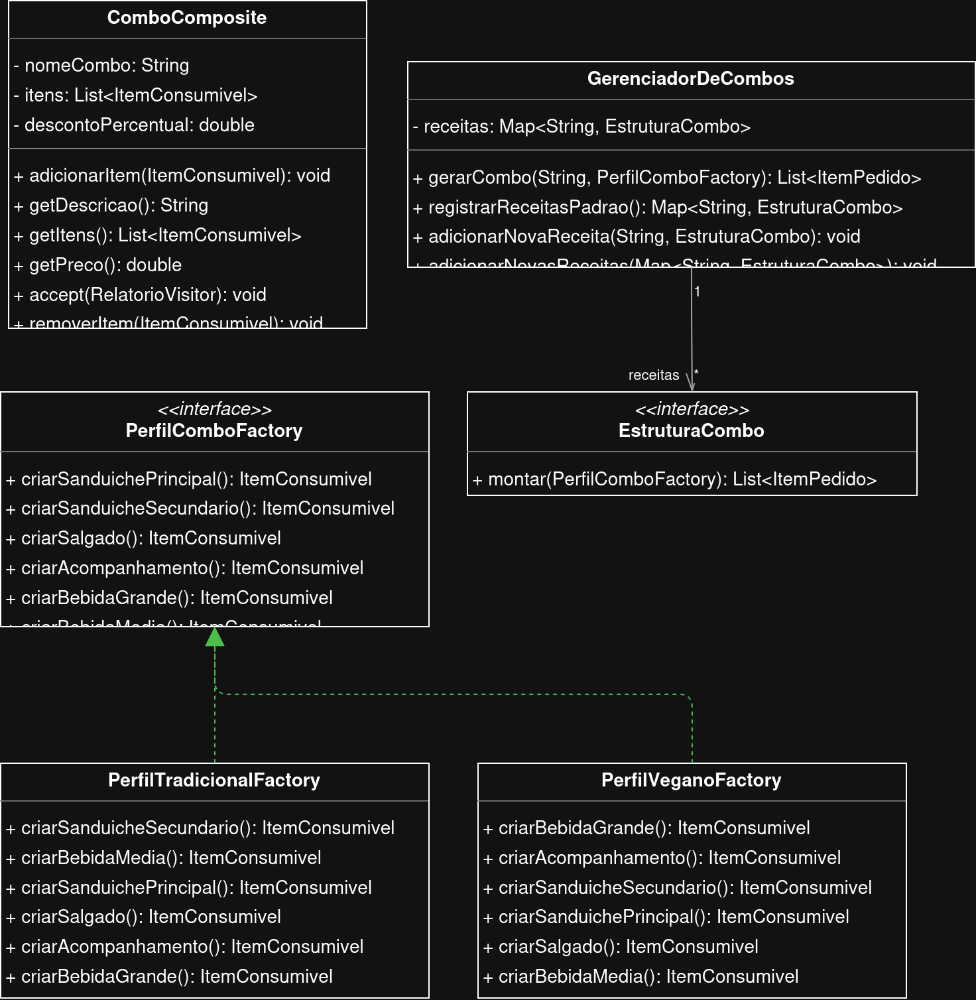
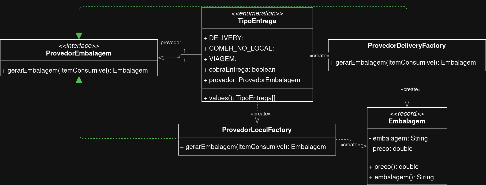
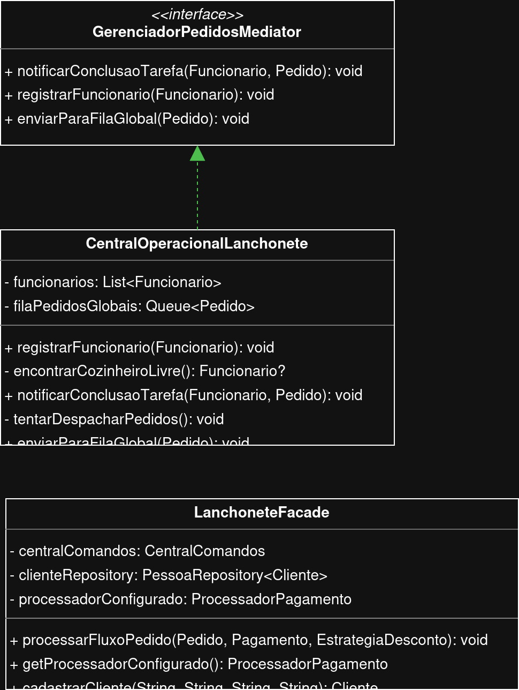
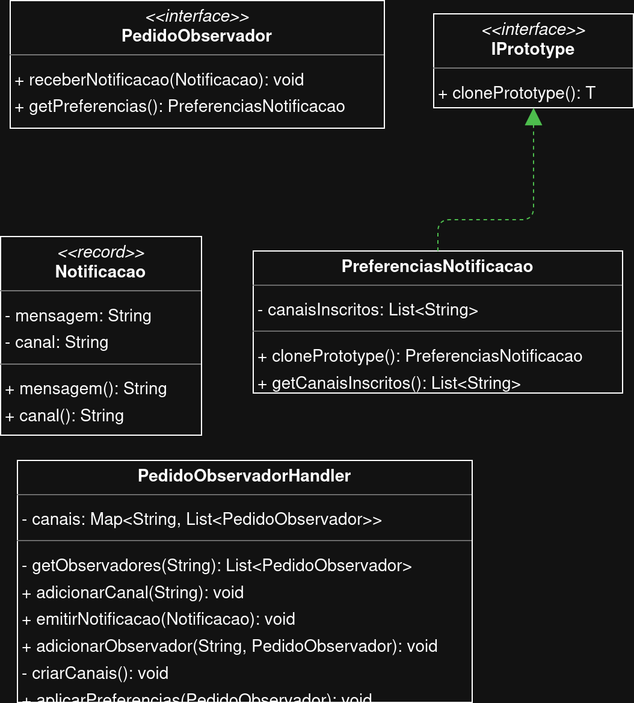
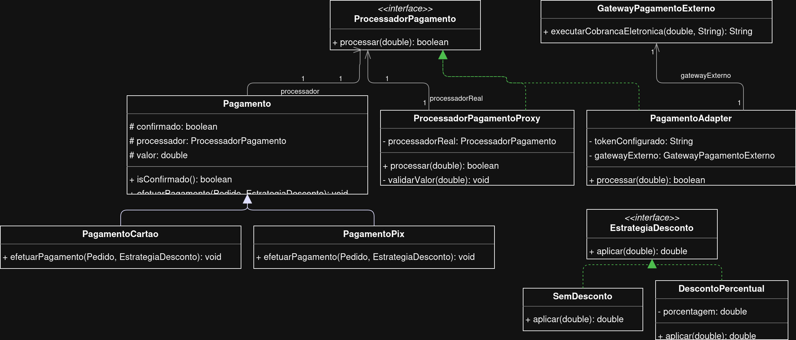
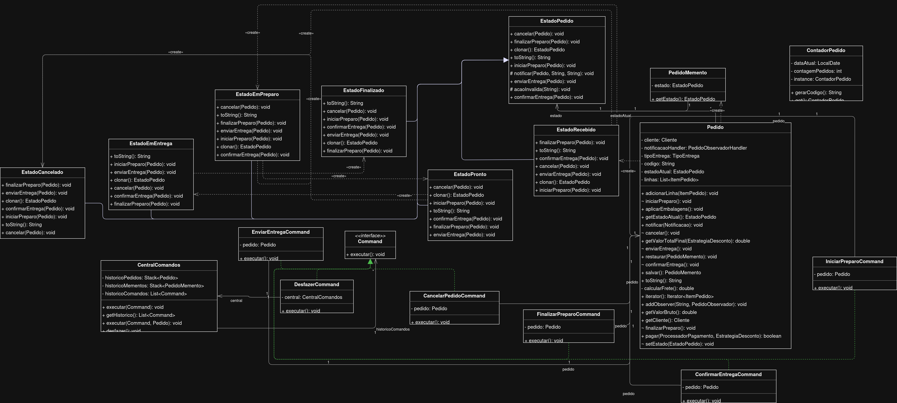
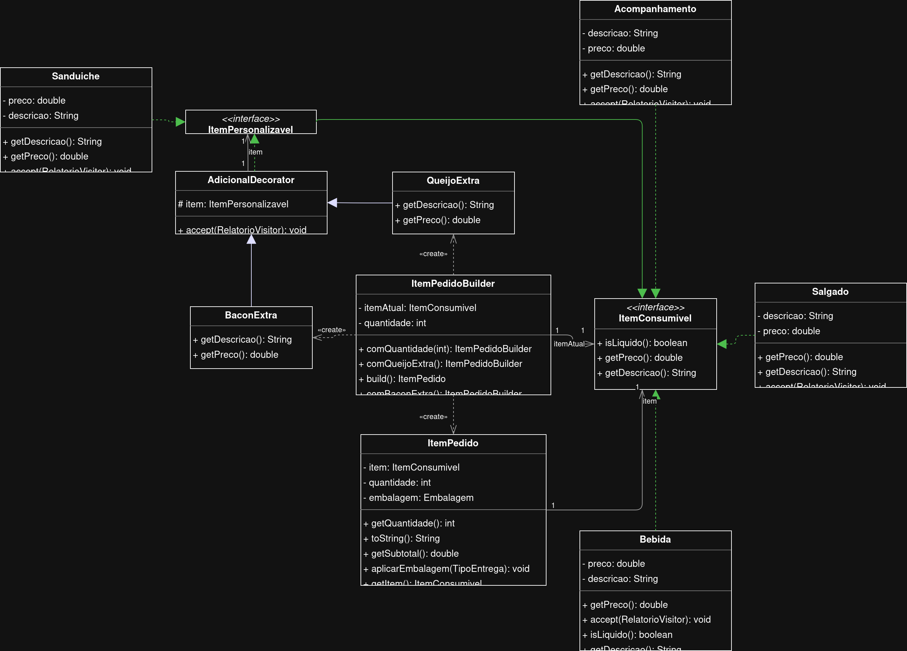
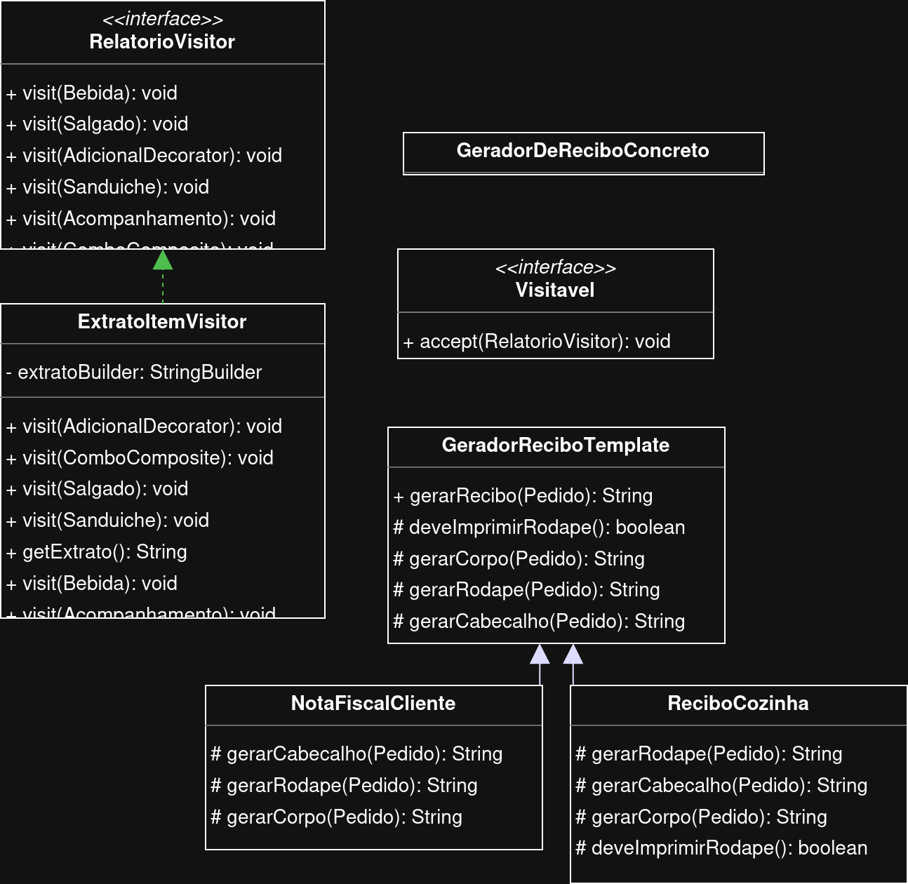
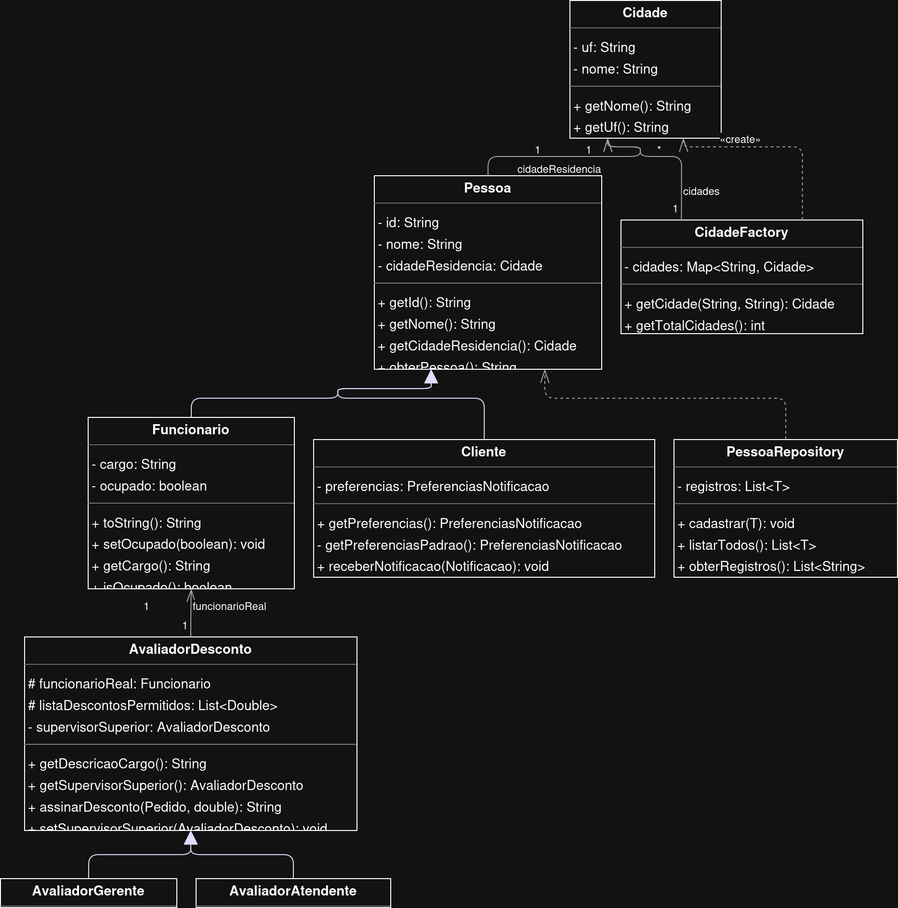
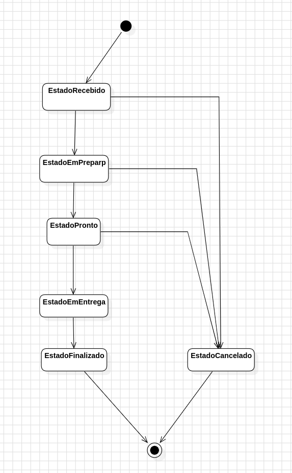

# Lanchonete LPV

Neste projeto, foi implementado um sistema de lanchonete utilizando o maior número de padrões de projeto (GoF) possível.

Abaixo está o diagrama de classes principal, bem como os diagramas de classe de cada pacote. Também está incluso o diagrama de estados referente ao padrão State. Mais abaixo, está a lista dos padrões implementados.

## Diagramas

### Diagrama principal

### Diagramas específicos de pacote

Package _combo_

Package _entrega_

Package _gerenciamento_

Package _notificacao_

Package _pagamento_

Package _pedido_

Package _produtos_

Package _relatorio_

Package _usuario_

### Diagrama de Estados 

Referente ao padrão _State_

## Padrões de Projeto

### 1. Padrões Criacionais (Creational Patterns)

Focam nos mecanismos de criação de objetos, tentando criar objetos de uma maneira adequada à situação.
   
- [x] Abstract Factory
- [x] Builder
- [x] Factory Method
- [x] Prototype
- [x] Singleton

### 2. Padrões Estruturais (Structural Patterns)

Focam em como classes e objetos são compostos para formar estruturas maiores.

- [x] Adapter
- [x] Bridge
- [x] Composite
- [x] Decorator
- [x] Facade
- [x] Flyweight
- [x] Proxy

### 3. Padrões Comportamentais (Behavioral Patterns)

Focam na comunicação entre os objetos, em como eles interagem e distribuem responsabilidades.

- [x] Chain of Responsibility
- [x] Command
- [ ] Interpreter
- [x] Iterator
- [x] Mediator
- [x] Memento
- [x] Observer
- [x] State
- [x] Strategy
- [x] Template Method
- [x] Visitor 

